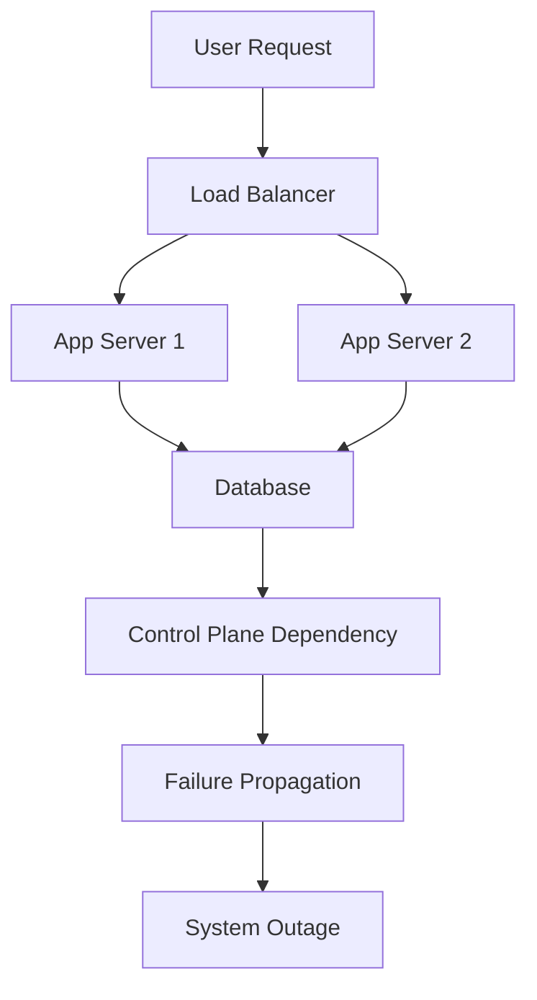
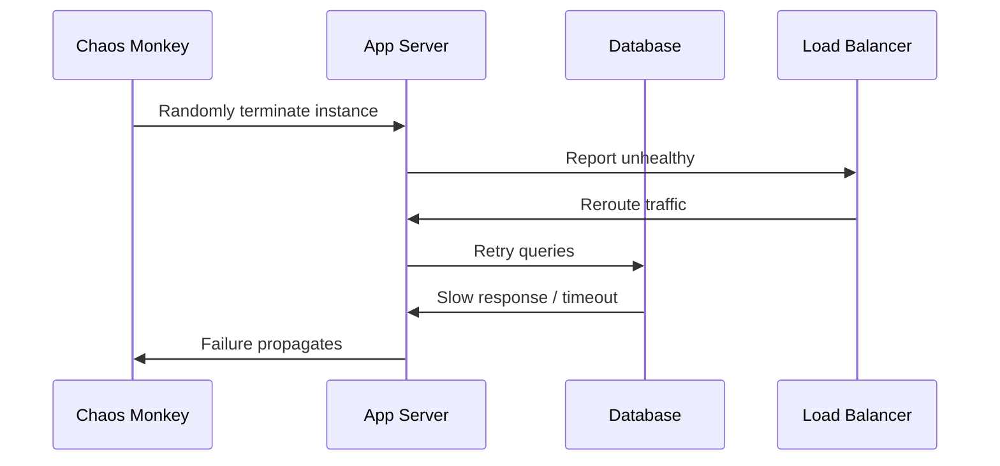

When AWS's control plane went down last month, it wasn't just another outage: it was a **wake-up call for every architect**. Thousands of systems that were supposed to be "resilient" collapsed instantly. Multi-AZ deployments didn't help. Auto-scaling didn't trigger. Failover mechanisms froze because the orchestrators themselves were down.  

In short: the cloud ate itself.

This isn't just about AWS. It's about the way we design systems, and the assumptions we make. Or, in Stoic terms, it's about our failure of **premeditatio malorum** : the practice of imagining disasters in advance so that we can withstand them.

---

## Fallacies of Distributed Computing : Revisited

Sun Microsystems documented the **8 Fallacies of Distributed Computing** decades ago. They still apply, painfully:

1. **The network is reliable** → DNS disagrees.  
2. **Latency is zero** → Retry storms prove otherwise.  
3. **Bandwidth is infinite** → Until congestion collapses your backplane.  
4. **The network is secure** → When failover automation can't reach IAM, security becomes irrelevant.  
5. **Topology doesn't change** → Until internal routing updates break assumptions.  
6. **There is one administrator** → And it's never you.  
7. **Transport cost is zero** → Cross-region data transfer proves otherwise.  
8. **The network is homogeneous** → Vendor lock-in and hidden dependencies expose fragility.

Every outage reminds us that **these fallacies are real, not academic exercises.**  

---

## Designing for Real Resilience

Many organizations “deploy across multiple AZs” and call it resilient. That's naive. Real resilience comes from **independence, not redundancy.**  

Key patterns:

- **Bulkheads:** Isolate failures within subsystems to prevent cascading collapse.  
- **Circuit breakers & backpressure:** Stop amplification before it overwhelms the system.  
- **Out-of-band recovery paths:** Ensure control and observation exist even when the primary platform fails.  
- **Active-active cross-region deployments:** Not just code deployed, but traffic actively routed and tested.  
- **Human playbooks:** Automation fails. Humans must rehearse disaster scenarios like pilots.

---

## Chaos Engineering: The Discipline of Breaking Systems

Netflix pioneered **Simian Army** years ago:

- **Chaos Monkey** randomly kills instances.  
- **Latency Monkey** injects delay.  
- **Conformity Monkey** tests dependency assumptions.
- **Chaos Gorilla** simulates entire availability-zone failures.  
- **Chaos Kong** simulates entire region failures.  

The goal: **rehearse failure before production forces it on you.**  

If you never break your own system, you don't know where it's weak. And if your chaos experiments are convenient or partial, you're training for the wrong failures.

---

## Visualizing Failure Propagation

Here’s a Mermaid diagram showing how a single control-plane failure can cascade through a system:

And here's a Chaos Monkey style sequence:

---

## Lessons from the AWS Outage

1. **Visibility is everything:** You can't defend what you can't see.  
2. **Assume failure at all layers:** Even control planes fail.  
3. **Test the worst-case scenario:** Not just single-instance failure, but regional, provider-wide, or orchestration-layer failures.  
4. **Design humans into the loop:** Automation alone isn't enough; humans must be able to respond.  
5. **Learn from history:** Distributed computing fallacies, chaos engineering principles, and Stoic practices like premeditatio malorum exist for a reason: they work.

---

### Closing Thought

Architecture is more than diagrams and standards. It's **a mindset of anticipation, humility, and preparation**.  

The AWS outage didn't teach us anything new. It merely exposed **who actually believes the principles we all claim to know.**  

Before your next system design session, ask yourself:

> Which assumptions am I still pretending are true?
